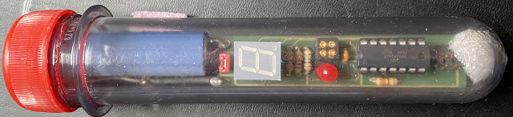
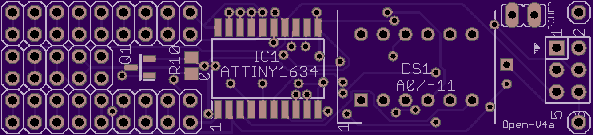
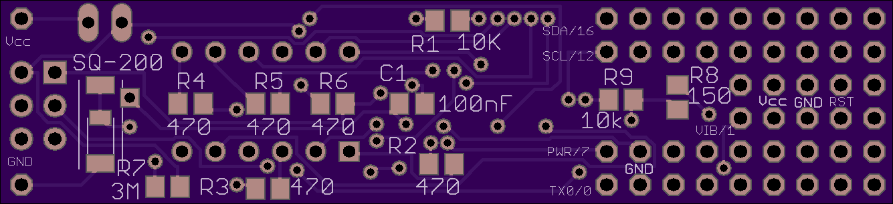

# The PET Preform Board

The **PET Preform Board** board is a small PCB (67.8 x 15.6 mm) intended to be placed into a preform tube (with length of > 13cm) together with a 3.6 volt Lithium battery. On the board, you can place an ATtiny1634 and a dot matrix 5x7 display as well as some sensor breakout board (such as the popular GY boards). Meanwhile we have reached version *V4a* of the board design. In order to give an idea, here is a photo of an earlier version of this board in a preform tube.

With an barometer, you can, for example, ask people to take the tube and carry it up to the summit of a hill. At the summit, the display then reavals a code. An example for this usage is for example the [geocache at Dagstuhl castle](https://coord.info/GC4XBM2).

You'll find the Eagle files in the subdirectory *doc/eagle* together with pictures of how the PCB looks like. Let us have a look of the top side.

On the right side, there is an ICSP header that one can use for programmig. Close to the ICSP header on the top, there is a 2-pin header for a power jumper. Without the jumper, the battery is cut off from the board. Then comes left of the ICSP header the place for the dot matrix display **DS1**, e.g., ***TA07-11SEKWA***. It is adivsable to chose a hyper-orange or hyper-red type such as the mentioned one because we can spare only a few mill Amps to light the dots. Even further left is the space for **IC1**, the MCU ***ATtiny1634***. Both the dot matrix display and the MCU have their respective 1-pins at the bottom to the left, as marked with the "1".

Left of the MCU, there is space for the *optional* resistor **R10** of 0Ω. Put that in if you want to connect the Vcc pin of a sensor directly with the battery. If you want to switch the power to the sensor, put in instead in the *optinonal* P-channel MOS-FET ***IRLML2244*** at the place marked Q1. 

Let us now look at the bootom of the board.

Now we start from the left, where we see the bottom of the ICSP header. Then there are SMD pads for an *optional* ***SQ-MIN-200*** or ***SQ-SEN-200*** vibration sensor. These are extremely sensitive, but also a bit expensive. Directly right to the pads are two through-hole pads that can be used for an alternative ***SW-18010*** vibration sensor, which is less expensive but also less sensitive.

The resistor **R7** is the pull-up for the vibration switch. The SW-18010 is usually open, but the SQ-xxx-200 switch is usually closed. So, 3MΩ seems to be a good value, limiting the quiescent current to roughly 1.2 µA. Currently, I use 10MΩ, which still works fine and saves even more power. The resistors **R2**-**R6** are current limiting resistors for the dot matrix display columns. I have labled them with 470Ω, but you also can use 330Ω or a lower value. You get a brighter display, but consume more power.  **R1** (10kΩ) is the usual pullup for the reset line and **C1** (100nF) is the blocking capacitor for the MCU. 

**R9** (10kΩ) is the pull-up for the MOSFET gate and **R8** (150Ω) is the current limiting resistor for the MOSFET. These two are, of course only necessary if one uses the MOSFET.

If you want to drive the sensor directly drom the MCU pin, then **R8** should be 0Ω and you need to put another such bridge from the gate pad to the drain pad of the MOSFET.

Out of the 17 I/O lines of the ATtiny1634, 12 are used for the dot matrix display, one line is used for the vibration switch, two lines are dedicated for I2C, but could be used for other pusposes, one line is intended to be used for switching the MOSFET, and one line can be used as a TX line for debug outputs or it can be used for any other purpose. The pin assignment is described in the following table.

| MCU pin | MCU function | Arduino pin | Function | Display pin |
| -------:| :------------| -----------:|:---------| -------:|
| 1       |TX0/PB0/ADC5  |        A5/0 | TX/GPIO  |         |
| 2       |RX0/PA7/PCINT7|        A4/1 | Vib/GPIO |         |
| 3       | PA6          |           2 | Row 7    | 6       |
| 4       | PA5          |           3 | Row 6    | 5       | 
| 5       | PA4          |           4 | Row 5    | 4       |
| 6       | PA3          |           5 | Row 3    | 2       |
| 7       | PA2          |           6 | Column 2 | 3       |
| 8       | PA1          |           7 |Power/GPIO|         |
| 9       | PA0          |           8 | Column 1 | 1       |
| 10      | GND          |             | GND      |         |
| 11      | Vcc          |             | Vcc      |         |
| 12      | PC5          |           9 | Column 5 | 8       |
| 13      | PC4          |          10 | Column 4 | 7       |
| 14      | RESET        |             |          |         |
| 15      | PC2          |          11 | Row 1    | 12      |
| 16      | PC1/SCK/SCL  |       A10/12| ICSP/I2C/GPIO |    |
| 17      | PC0          |          13 | Row 2    | 11      |
| 18      | PB3          |          14 | Row 4    | 9       |
| 19      | PB2/MISO     |          15 | ICSP/Column 3 | 10 |
| 20      | PB1/MOSI/SDA |       A6/16 | ICSP/I2C/GPIO |    |

An include file for the current version of the board is **PETPreformBoard.h** in the *src* directory.
